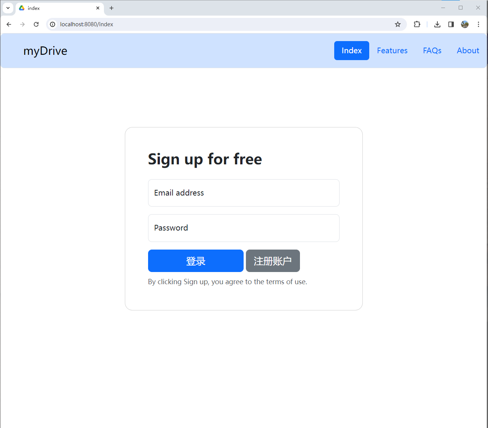

# 毕业设计 

## myDrive 基于Java的网盘系统

## 基本功能
- 用户注册登录
- 文件上传、下载、重命名、移动、删除 
- 文件夹新建、重命名、移动、删除
- TODO 文件版本控制和文件分享

## Feature 系统功能特性
- ### 使用分片上传
    > 前端会将大文件进行分片(文件默认分片大小为10MB),
    并计算分片的hash值,并和后端计算的分片hash值进行比对,确保文件未被篡改
- ### 秒传 
   分片级别秒传
  >   将文件分片的hash值与服务端分片表中的hash值进行比对，如果比对成功,服务端就已经存储了该文件,实现秒传

   文件级秒传
  >用户感知层面体验到的是文件级别的秒传,底层使用分片级别秒传的组件

- ### 存储优化
    > 用户上传不同文件如果具有hash值相同的分片只需要存储一次,
   但需额外的逻辑来管理分片的引用计数或其他机制，
   以确保当所有引用某个分片的文件都被删除时，该分片也能被相应地删除
- ### TODO Version control版本管理(内置jGit)
    > 用户自主选择是否为文件开启版本控制(通常为文本文件,或需要进行协作的文件)

### 具体界面效果  
